# Flixr

Movie and TV discovery built on TMDB, with a first-party review layer.

The interesting part isn't the catalog UI - it's the middle tier. Flixr runs a small
Express BFF that owns the TMDB key, collapses the expensive composite reads into single
requests, and serves everything through a read-through Redis cache. The clients never
talk to TMDB directly and never see a credential.

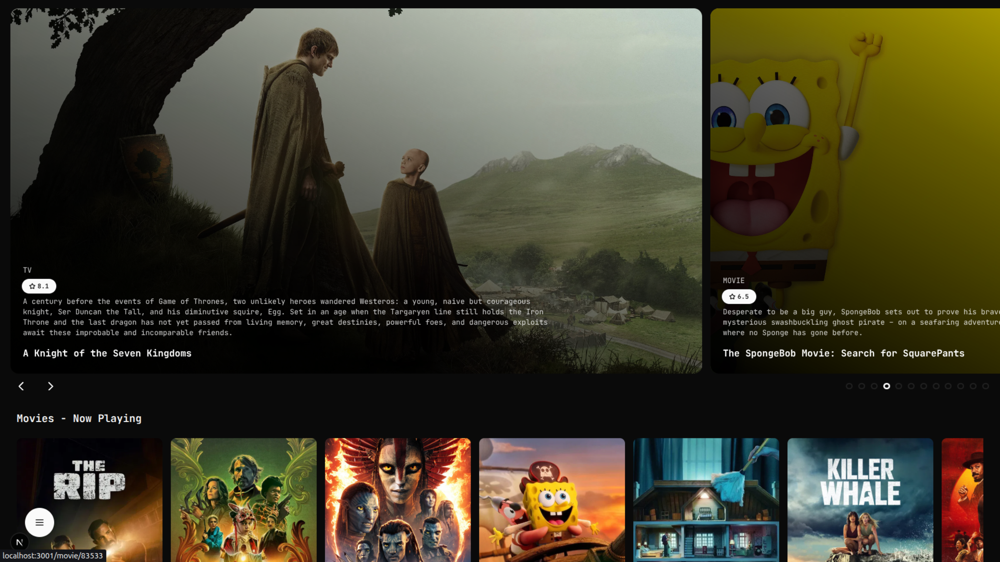

## How it works

```
browser ──▶ Next.js (RSC)  ──▶  Express  ──▶  TMDB
                                     │
                                     ├──▶ Redis    read-through cache
                                     └──▶ MongoDB  users, reviews, comments
```

A few things I cared about while building it:

- **Read-through cache with single-flight.** `getCached()` centralises get / miss /
  `setex` with per-call TTLs. Concurrent misses on the same key share one upstream
  fetch, so a cold homepage doesn't fire twelve duplicate requests at TMDB.
- **Composite reads degrade instead of failing.** `/api/common/homepage` fans out to
  twelve TMDB calls with `Promise.allSettled`, so one bad upstream response costs you a
  row, not the page.
- **Untrusted input is allowlisted, not forwarded.** Discover params, `append_to_response`
  values, and page numbers are each filtered or clamped before they reach TMDB -
  otherwise anyone can fan one request into many and burn the shared quota.
- **Fail-fast config.** The server refuses to boot without a `TMDB_API_KEY` or with a
  `JWT_SECRET` under 32 characters, rather than discovering it at request time.
- **Ownership is enforced on writes.** Review and comment edits/deletes compare the
  JWT subject against the document's author.

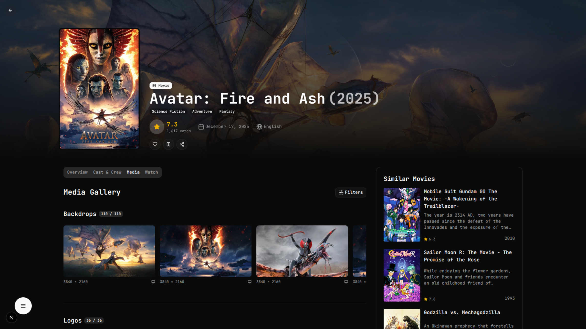

## Running it

You need Node 22, pnpm, MongoDB, Redis, and a [TMDB API key](https://www.themoviedb.org/settings/api).

**Backend** - http://localhost:4000

```bash
cd backend
pnpm install
cp .env.example .env          # set TMDB_API_KEY and JWT_SECRET
pnpm dev
```

Generate the secret with `openssl rand -hex 48`. `GET /health` returns 200 once Mongo
is connected, 503 until then.

**Frontend** - http://localhost:3000

```bash
cd frontend
pnpm install
cp .env.example .env.local
pnpm dev
```

For production, `pnpm build && pnpm start` in both.

## Environment

Backend (`backend/.env`) - see `.env.example` for the full list:

| Variable | Notes |
| --- | --- |
| `TMDB_API_KEY` | Required. Validated at boot. |
| `JWT_SECRET` | Required, min 32 chars. Validated at boot. |
| `MONGO_URI` | Defaults to `mongodb://localhost:27017/tmdbapp`. |
| `REDIS_HOST` / `REDIS_PORT` | Defaults to `127.0.0.1:6379`. |
| `CORS_ORIGINS` | Comma-separated browser origin allowlist. |
| `TRUST_PROXY` | Reverse-proxy hops to trust. Rate limiting is keyed by client IP, so this matters behind nginx or Docker. |
| `RATE_LIMIT_MAX` | Global per-IP requests per minute. Default 200. |

Frontend (`frontend/.env.local`):

| Variable | Notes |
| --- | --- |
| `NEXT_PUBLIC_API_URL` | Backend base URL. **Inlined at build time** - it has to be an address the visitor's browser can reach, not an internal Docker service name. |

## API

All routes are under `/api`. Catalog reads are public; writes require a bearer token.

| Group | Endpoints |
| --- | --- |
| `auth` | `POST /register`, `POST /login` |
| `movies` | `search`, `popular`, `top_rated`, `now_playing`, `upcoming`, `trending/:window`, `discover`, `genres`, `:id`, `:id/{credits,videos,images,reviews,similar,recommendations,external_ids,watch-providers,aggregate}` |
| `tv` | `search`, `popular`, `top_rated`, `on_the_air`, `airing_today`, `discover`, `genres`, `:id`, `:id/season/:n`, plus the same per-title sub-resources |
| `people` | `search`, `popular`, `:id`, `:id/{credits,images,external}` |
| `companies` | `:id` |
| `common` | `homepage`, `search`, `trending`, `genres` - the composite fan-out endpoints |
| `reviews` | `POST /`, `GET /mine`, `GET /tmdb/:mediaType/:tmdbId`, `PUT /:id`, `DELETE /:id` |
| `comments` | `POST /`, `GET /media/:mediaType/:tmdbId`, `GET /review/:reviewId`, `PUT /:id`, `DELETE /:id`, `POST /:id/like` |

## Layout

```
backend/     Express 5 · TypeScript · Mongoose 9 · ioredis · JWT · Joi
frontend/    Next.js 16 App Router · React 19 · Tailwind 4 · Redux Toolkit · Radix
flixr/       Expo / React Native client - paused, see below
docs/        Architecture, design system, audit, roadmap
```

## Status

This is a personal project, and I'd rather be straight about where it is.

Working end-to-end: catalog browse and discovery, search, movie/TV/person/season detail
pages, legal streaming availability via TMDB's JustWatch data, and the community review
loop - a signed-in user posts a review and sees it on the title and on their profile.

Not there yet: there are no automated tests and no CI, auth tokens live in
`localStorage` rather than httpOnly cookies, and the mobile client is a paused skeleton
(hardcoded LAN address, no auth) that I stopped investing in to finish the web surface
properly.

## Attribution

This product uses the TMDB API but is not endorsed or certified by TMDB. 
Movie and TV metadata and images are © The Movie Database. 
Streaming availability is provided by JustWatch through TMDB.


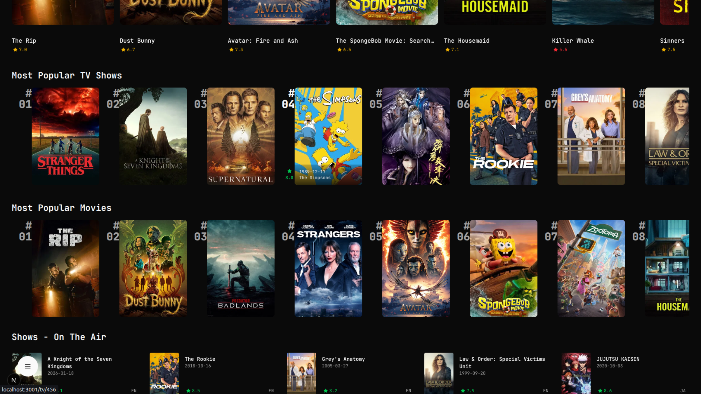
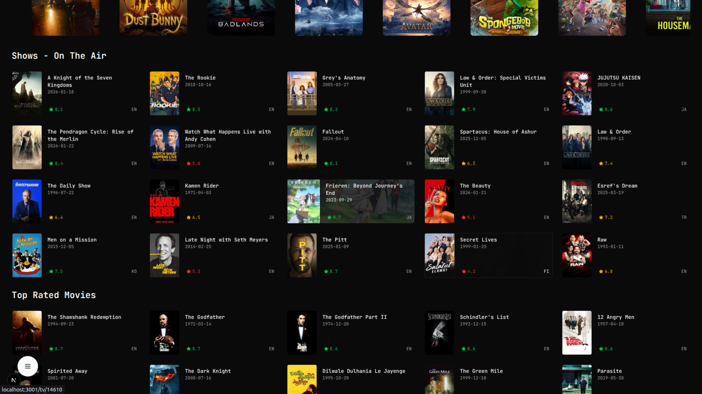
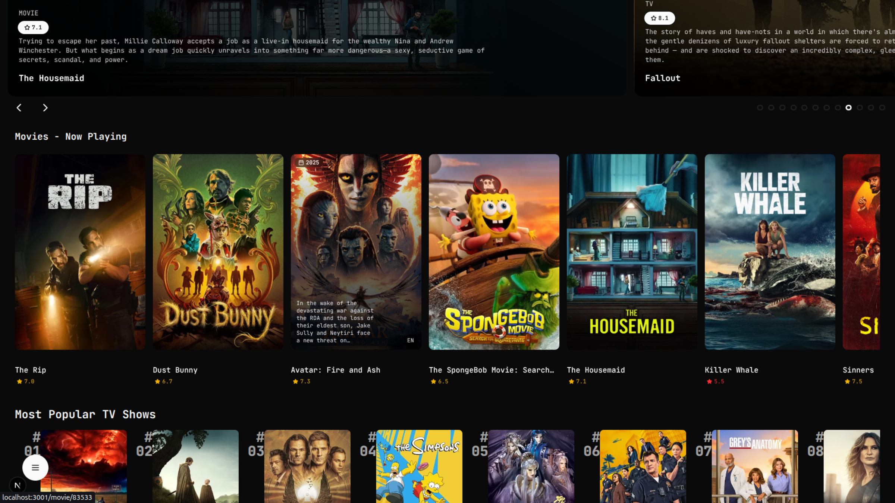
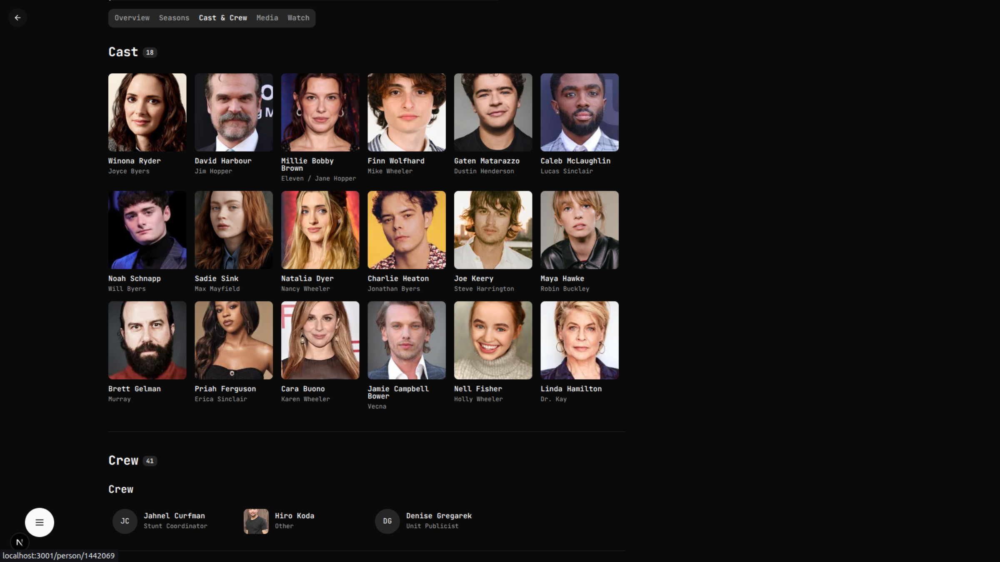
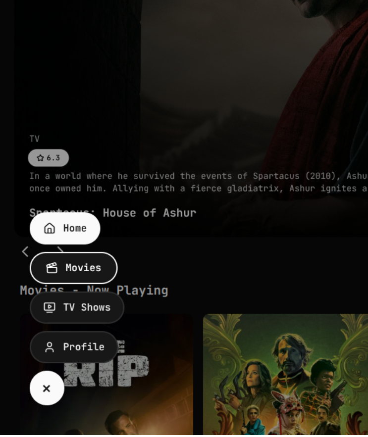
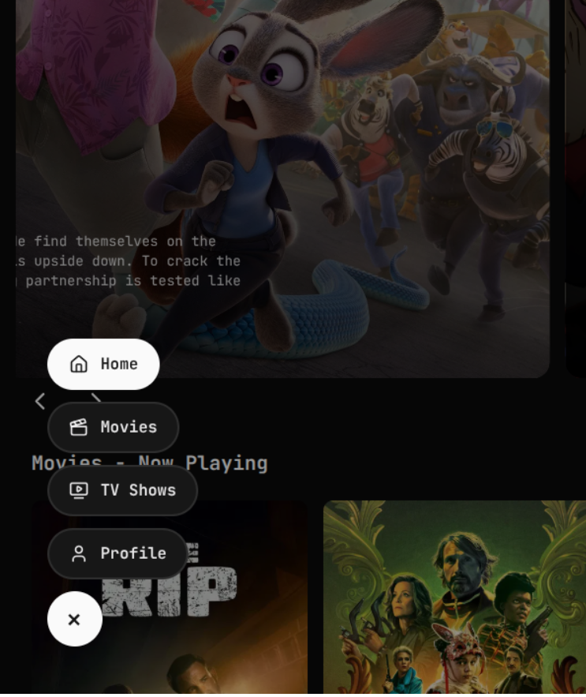
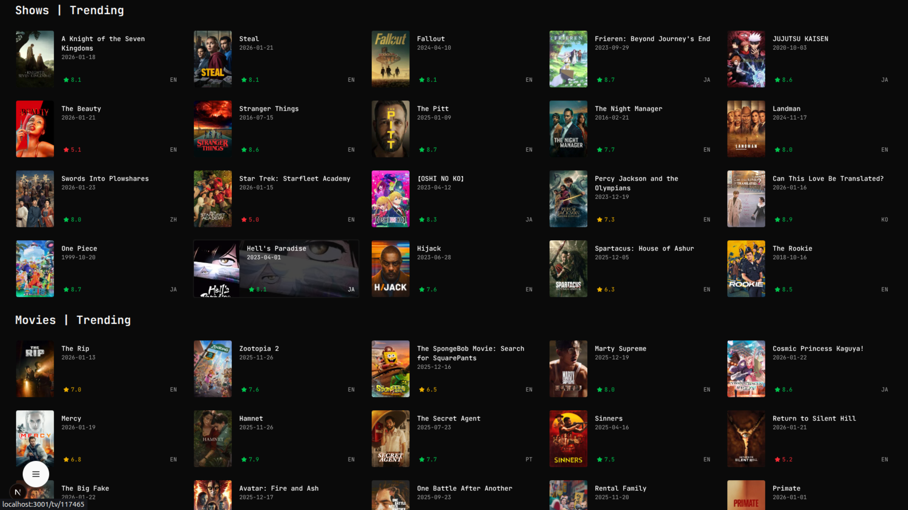
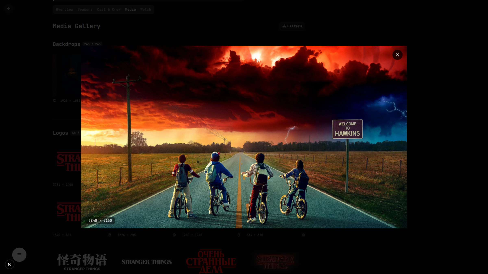
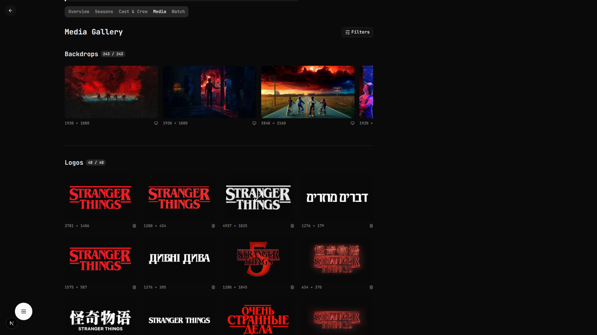
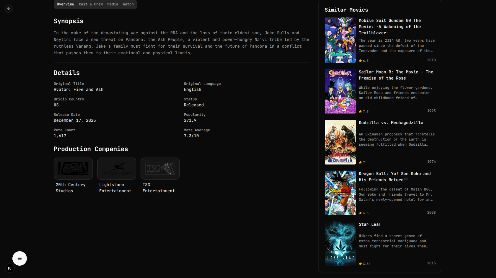
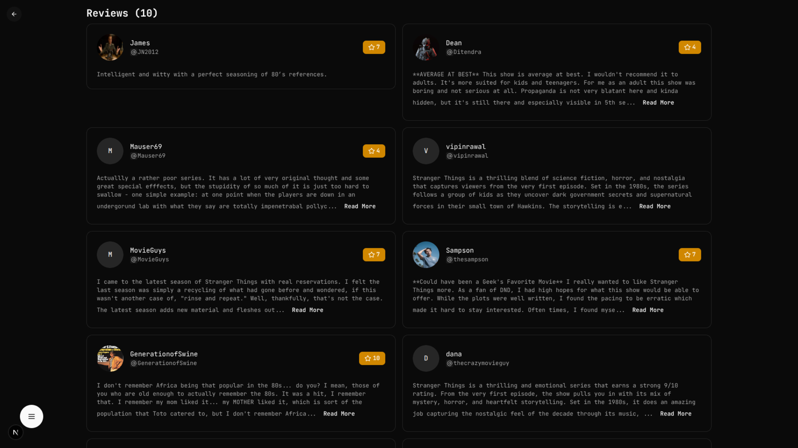
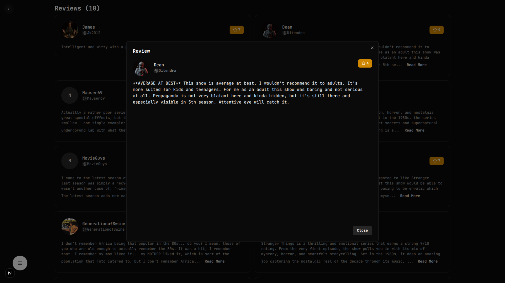
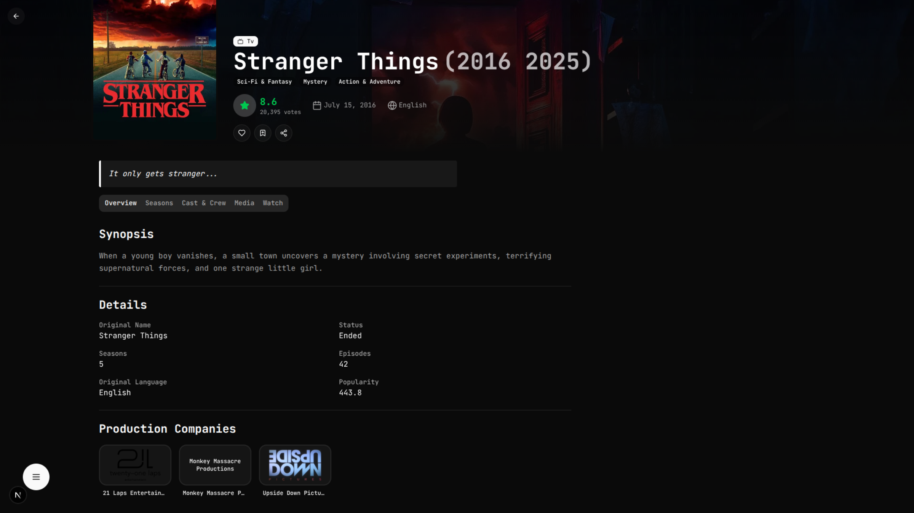
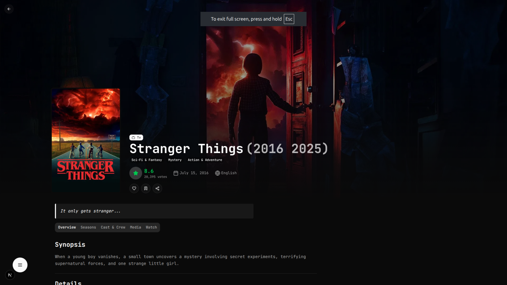
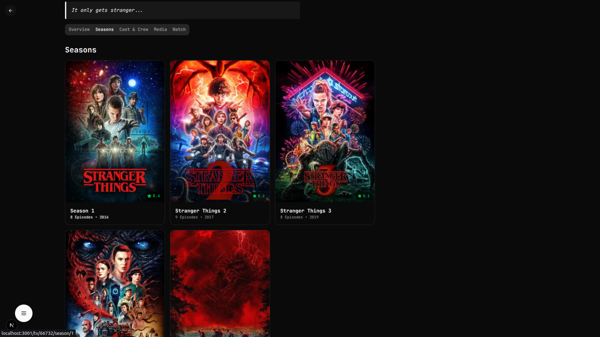